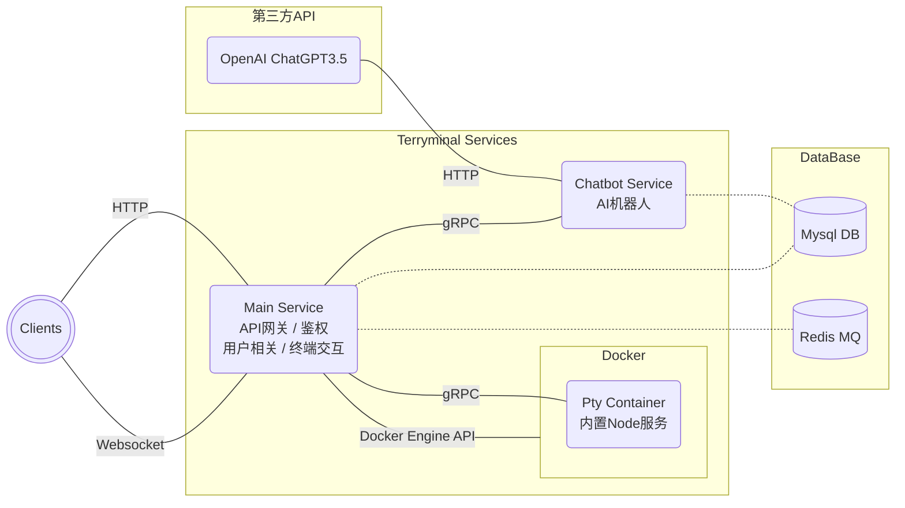
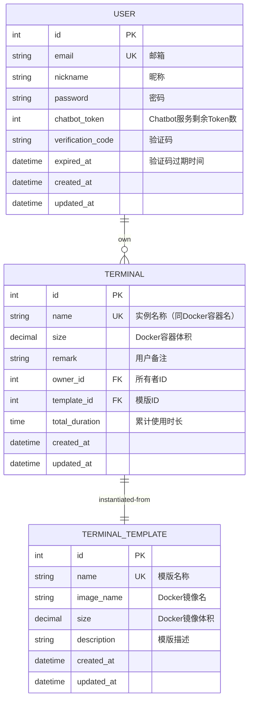

# Terryminal

The backend of Terry's online Terminal

## 界面演示

_待补全..._

## 架构图

## ER 图

## 主要依赖

- [**gRPC**](https://grpc.io/)
- [**sqlc**](https://docs.sqlc.dev/en/stable/index.html)（sql->go 接口）
- [**Protocol Buffers**](https://protobuf.dev)（gRPC 数据定义）
- [**Asynq**](https://github.com/hibiken/asynq)（任务队列异步处理框架）
- [**golang-migrate**](https://github.com/golang-migrate/migrate)（数据库迁移）
- [**Paseto**](https://github.com/o1egl/paseto)（用户鉴权）

## 端口划分

为便于本地调试，划分不同服务所使用的端口，作以下规定：

- main-service 端口范围：3200-3209
- chatbot-service 端口范围：3210-3219
- pty-docker 端口范围：3220-3229

## 接口文档

[**API 文档**](https://www.apifox.cn/apidoc/shared-3e28c033-bc0d-436e-93de-6f0e6045d53d)

## 服务端部署

- 修改根目录下 compose.yaml 与 Makefile 相关信息
- 应用容器化

  - 方法一：在服务器端拉取代码，执行`make build_images`，打包镜像
  - 方法二：本地执行`make build_push_multi`，打包多平台镜像并推至 hub

- 服务端执行`docker compose up -d`
